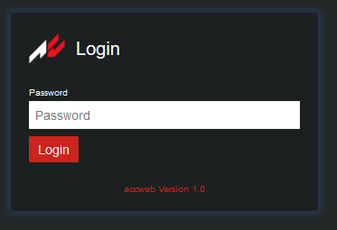
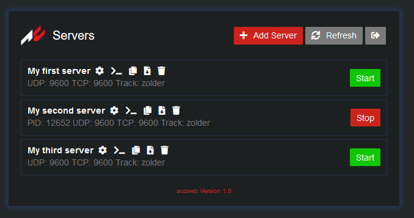
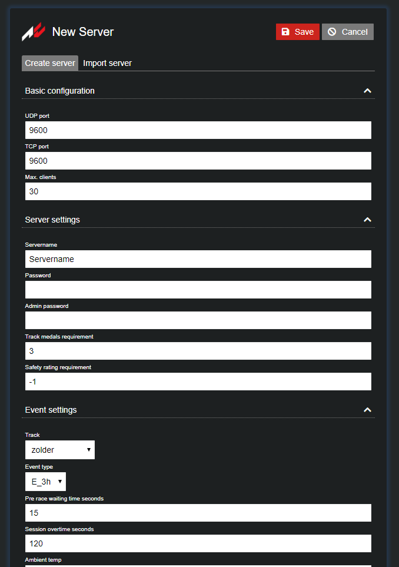
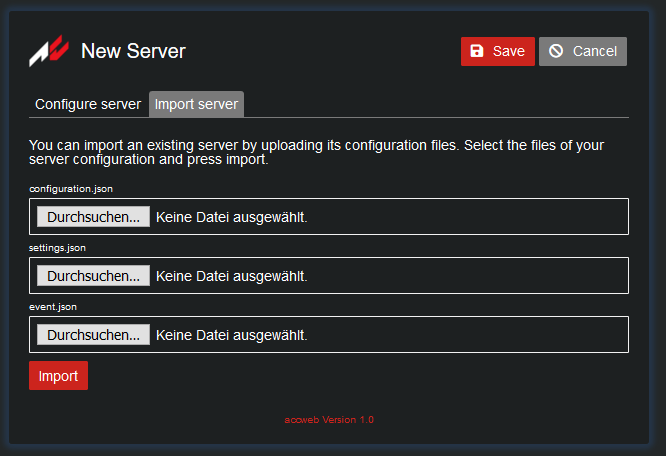
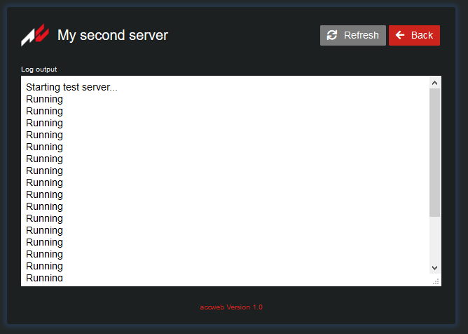
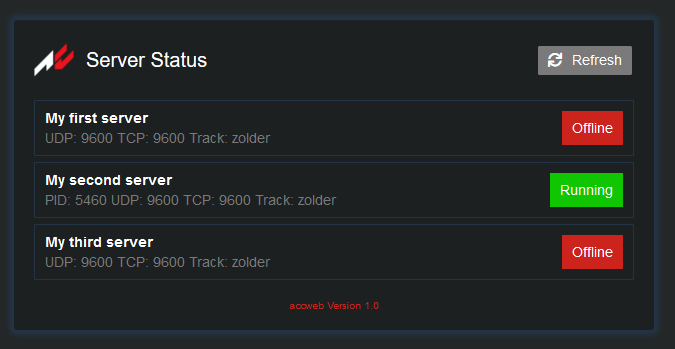

# Assetto Corsa Competizione Server Web Interface

[](https://circleci.com/gh/assetto-corsa-web/accweb)
[](https://goreportcard.com/report/github.com/assetto-corsa-web/accweb)

The successor of [acweb](https://github.com/assetto-corsa-web/acweb)! accweb lets you manage your Assetto Corsa Competizione servers via a nice and simple web interface. You can start, stop and configure server instances and monitor their status.

## Table of contents

1. [Features](#features)
2. [Installation](#installation)
3. [Contribute and support](#support)
4. [Links](#links)
5. [License](#license)
6. [Screenshots](#screenshots)

## Features
<a name="features" />

* create and manage as many server instances as you like
* configure your instances in browser
* start/stop instances and monitor their status
* view server logs
* copy server configurations
* import/export server configuration files
* delete server configurations
* three different permissions: admin, mod and read only (using three different passwords)
* status page for non logged in users
* easy setup
    * no database required
    * simple configuration using environment variables

## Installation and configuration
<a name="installation" />

accweb can be installed manually or by using Docker. Both installation methods use environment variables for configuration. Here is a list with all configuration variables and possible values. The instructions below don't use all of them.

```
ACCWEB_LOGLEVEL=debug|info
ACCWEB_ALLOWED_ORIGINS=*|<your domain or IP>
ACCWEB_CORS_LOGLEVEL=debug|<empty>
ACCWEB_HTTP_WRITE_TIMEOUT=<seconds>
ACCWEB_HTTP_READ_TIMEOUT<seconds>
ACCWEB_HOST=<ip>:<port>
ACCWEB_TLS_ENABLE=true|false
ACCWEB_TLS_CERT=<path to certificate>
ACCWEB_TLS_PKEY=<path to private key>
ACCWEB_CONFIG_PATH=<path server configurations are stored>
ACCWEB_SERVER_DIR=<path to ACC server directory>
ACCWEB_TOKEN_PUBLIC_KEY=<path to public key for token generation>
ACCWEB_TOKEN_PRIVATE_KEY=<path to private key for token generation>
ACCWEB_ADMIN_PASSWORD=<password>
ACCWEB_MOD_PASSWORD=<password>
ACCWEB_RO_PASSWORD=<password>
```

To set one of these, use `set NAME=value` on Windows and `export NAME=value` on Linux before you start the accweb executable. The `start.sh` and `start.cmd` as well as the `docker-compose.yml` use recommended default values, but you meight have to change a few of them.
`ACCWEB_ADMIN_PASSWORD`, `ACCWEB_MOD_PASSWORD` and `ACCWEB_RO_PASSWORD` are used to configure the administrator, moderator and read only passwords. They must be set or accweb won't start. Make sure you use a unique strong pasword for each of them.

### Manuall installation

1. download the latest release from the release section on GitHub
2. extract the zip file on your server
3. edit the `start.sh` (Linux) or `start.cmd` (Windows) to your needs
4. open a terminal
5. change directory to the accweb installation location
6. generate a new RSA key pair for user tokens (this is important for security!) and place them as `token.private` and `token.public` inside a new directory called `secrets`
7. create an empty directory called `config` inside your installation directory
8. run the start script (`./start.sh` on Linux and `start.cmd` on Windows)
9. leave the terminal open (or start in background using screens on Linux for example)
10. visit the server IP/domain and port you've configured, for example: http://example.com:8080

I recommend to setup an SSL certificate, but that's out of scope for this instructions. You can enable a certificate by using the environment variables above.

To generate the RSA key pair, you can use the `gen_rsa_keys.sh` on Linux or install one of the tools available for Windows. You can also use an online service which generates RSA key pairs (search for "generate rsa key pair online").

### Docker installation

*NOT READY YET*
*I'll add Docker when they have released an official Linux server binary.*

To be able to run accweb through Docker, you have to install Docker and Compose on your server. Please refer to the Docker/Compose documentation on how to do that.

1. copy the `docker-compose.yml` and place it on your server
2. edit `docker-compose.yml` to your needs
2. open a terminal
3. change directory to the `docker-compose.yml` location
4. start accweb with the command: `docker-compose up -d`

## Contribute and support
<a name="support" />

If you like to contribute, have questions or suggestions you can open tickets and pull requests on GitHub.

All Go code must have been run through go fmt. The frontend and backend changes must be (manually) tested on your system. If you have issues running it locally open a ticket. You can use the `dev.sh` and `gen_rsa_keys.sh` scripts to start accweb on your computer (on Linux).

## Links
<a name="links" />

* [Docker Hub](https://cloud.docker.com/repository/docker/kugel/accweb/general)
* [Assetto Corsa Forums](https://www.assettocorsa.net/forum/index.php?threads/release-accweb-assetto-corsa-competizione-server-management-tool-via-web-interface.57572/)

## License
<a name="license" />

MIT

## Screenshots
<a name="screenshots" />







